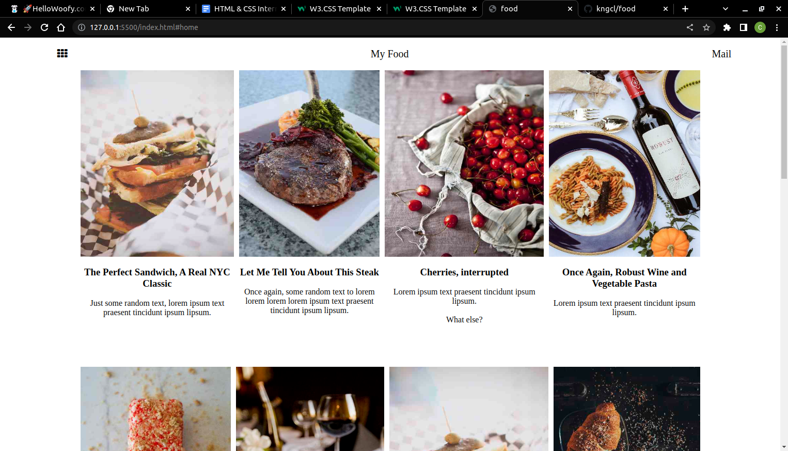
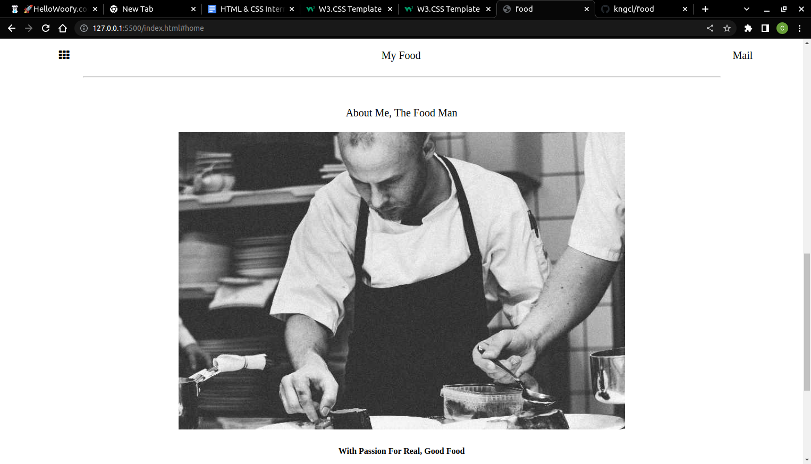

# Food project

food project display information on several type of diet.

## food

this project shows meals of different types and or variety.

## About

I have a heart of love and an interest of lorem ipsum and mauris neque quam blog. I want to share my world with you.

## App

### Prerequisites

Knowledge about:

- HTML
- CSS
- Google chrome
  
## Clone project

- To get a local copy up and running follow these simple example steps.
- Clone this repository with `git@github.com:kngcl/food.git` using your terminal.
- Change to the project directory by entering: cd food in the terminal.

## steps

- $ git clone `git@github.com:kngcl/food.git`
- $ `cd parallax`
- $ `git checkout feature/footer`

## Start App

- run by opening the index.html in the browser

## Author

👤 **kngcl**

- GitHub: [@kngcl](https://github.com/kngcl/food)

## 📝 License

This project is [w3school](./LICENSE) licensed.
